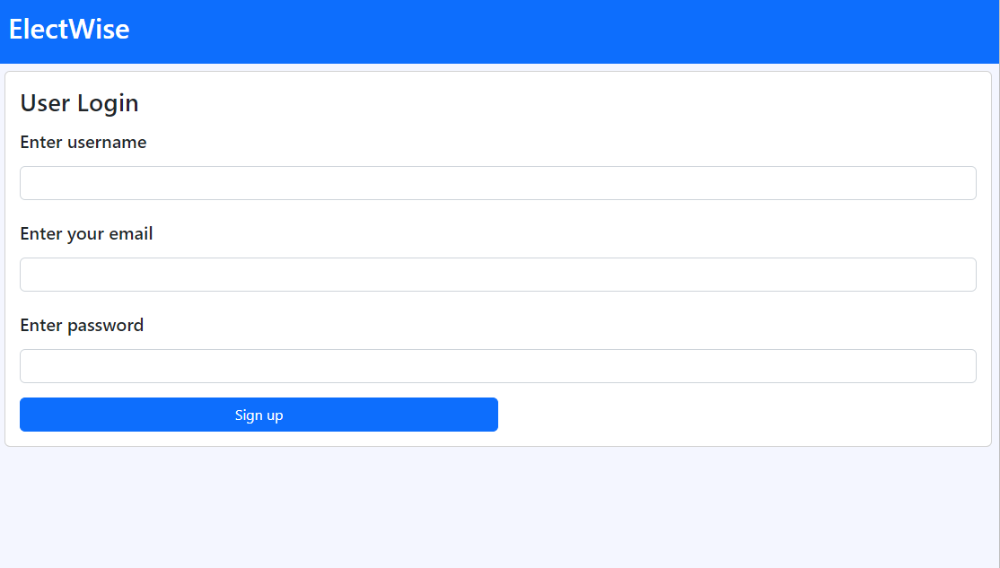
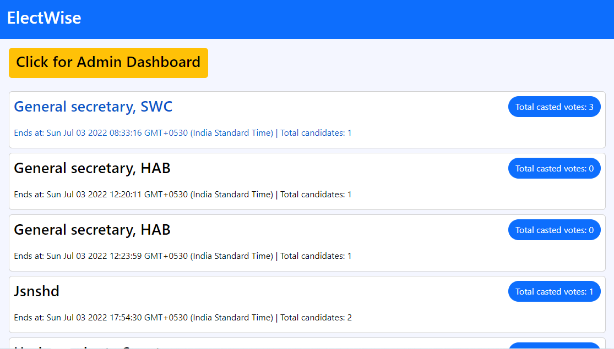

<br />
<p align="center"></p>

# ElectWise
#### ElectWise is a voting platform built on ethereum test network to conduct secure elections. This project is inspired from IIT Guwahati Gymkhana elections 2022 which was also conducted on blockchain.

## Live Demo
#### This project is deployed on Heroku which you can view at [ElectWise Website](https://socialist-poutine-04150.herokuapp.com/) and view [ppt here](https://www.canva.com/design/DAFGFU1gF6o/d4-SrI8fGG-aYbfJfO1r2Q/view)

## 🧩 Main Features
#### <ul><li>Homepage for completed & ongoing elections</li><li>Token based autentication for securing url routes</li><li>Results & Vote statistics for completed elections</li><li>Admin Dashboard to add new elections</li></ul>

## 📖 Pages
#### <ul><li>Home Page</li><li>Elections Page</li><li>Results Page</li><li>Admin's Dashboard</li><li>Login & SignUp Pages</li><li>404 Error Page</li></ul>

## 💻 TechStack Used
#### <ul><li>ReactJS</li><li>BootStrap</li><li>JavaScript</li><li>Node.js</li><li>Express</li><li>MongoDB</li><li>Solidity</li><li>Goerli test network & Alchemy's node API</li></ul>

## Prerequisites
#### Node.js should be installed on your system
#### A MetaMask Account with some ethers in goerli's test network.
#### Copy connected node's API URL to blockchain network by creating a new project on Alchemy keeping "goerli network" as selected.
#### Deploy "./smart_contract/contracts/ElectionPortal.sol" file's content using remix website on goerli test network and copy address of deployed contract.
#### Make account on Cloudinary (used to upload images) and get upload preset from your account's settings
#### <ul><li>[Node.js](https://nodejs.org/en/)</li><li>[MetaMask extension](https://microsoftedge.microsoft.com/addons/detail/metamask/ejbalbakoplchlghecdalmeeeajnimhm)</li><li>[Alchemy Website](https://www.alchemy.com/)</li><li>[Remix IDE](https://remix-project.org/)</li><li>[Cloudinary Account's Preset](https://blog.logrocket.com/handling-images-with-cloudinary-in-react/#:~:text=%20Handling%20images%20with%20Cloudinary%20in%20React%20,will%20upload%20images%20to%20Cloudinary%20by...%20More%20)</li></ul>

## 🎪 Getting Started
```
First we need to configure a .env file for secret variables used

You need to add following varaibles in your .env file in the root folder:

1. MONGODB_URL : // This should be the connection URL of your MongoDB database (eg: mongodb+srv://<Username>:<Password>@cluster1.segmc.mongodb.net/iitgStackoverflow?retryWrites=true&w=majority)
2. JWT_SECRET : // This can be any string of your choice (eg: WeAreDevelopers)
3. ADMIN_JWT_SECRET : // This can be any string of your choice (eg: WeAreDevelopersPlusAdmins)
4. PORT : 8000 // port number on which this project will work
5. JSON_NODE_API : // This the JSON RPC Node's API URL which you got from alchmey's project (eg: https://eth-goerli.alchemyapi.io/v2/<API SECRET>)
6. WALLET_MNEMONIC : // This is the secret of your metamask's account
7. CONTRACT_ADDRESS : // This is the address of deployed contract on goerli's test network (eg: 0xaXXXXXXXXXXXXXXXXXXXX).
8. ADMIN_EMAIL : // This is the admin email you want to set for admin dashboard access (eg: abc@xyz.com)
9. ADMIN_SECRET : // This can be any string of your choice (eg: IamAdmin)
10. REACT_APP_CLOUDINARY_UPLOAD_PRESET : // This is your cloudinary account's preset (eg : txy345j).
```
#### <ul><li>Now in the root of project folder, we need to run the command : node server.js</li><li>Server should have started and headover to "http://localhost:8000" to see the project in working 🙌.</li></ul>

# 🖼️ Some glimpse of the website
## Signup Page

<br />

## Login Page

<br />

## HomePage

<br />

## Add Question Page

<br />

## Question Discussion Page

<br />

<br />

## Profile Page

<br />

## 404 Error Page

<br />
<br />

# 🐛 Bug Reporting
#### Feel free to [open an issue](https://github.com/Kunalpal215/stacklimit-community-QnA-platform/issues) on GitHub if you find any bug.

<br />

# ⭐ Feature Suggestion
#### Feel free to [open an issue](https://github.com/Kunalpal215/stacklimit-community-QnA-platform/issues) on GitHub if you have feature idea to be added 🙌.

```
Thanks for visiting my repository 😊!! Please give a star ⭐ if you liked my project.